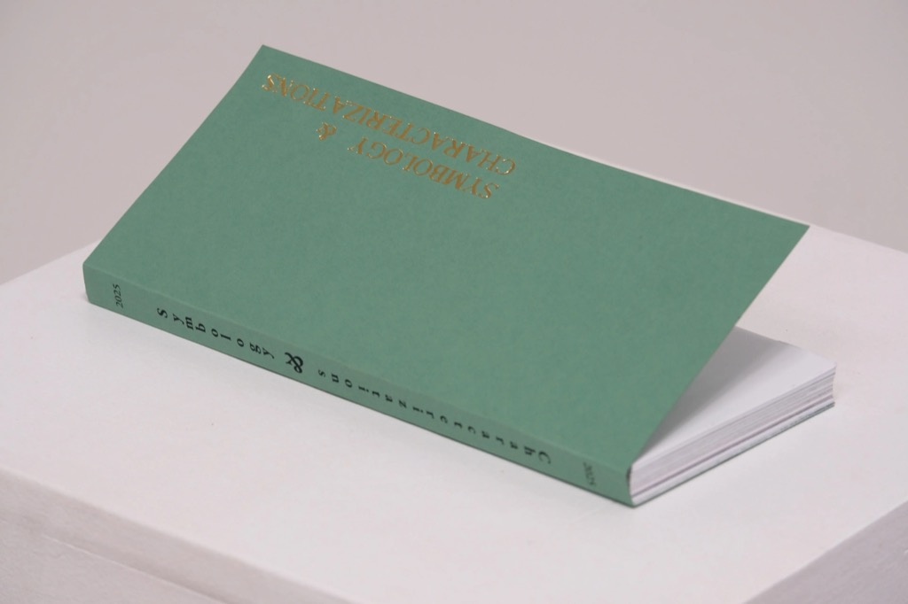
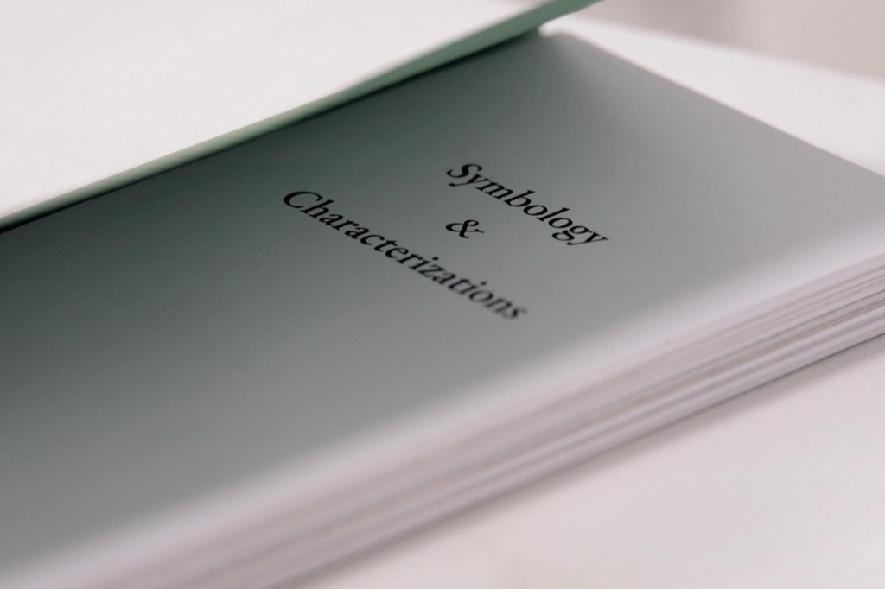
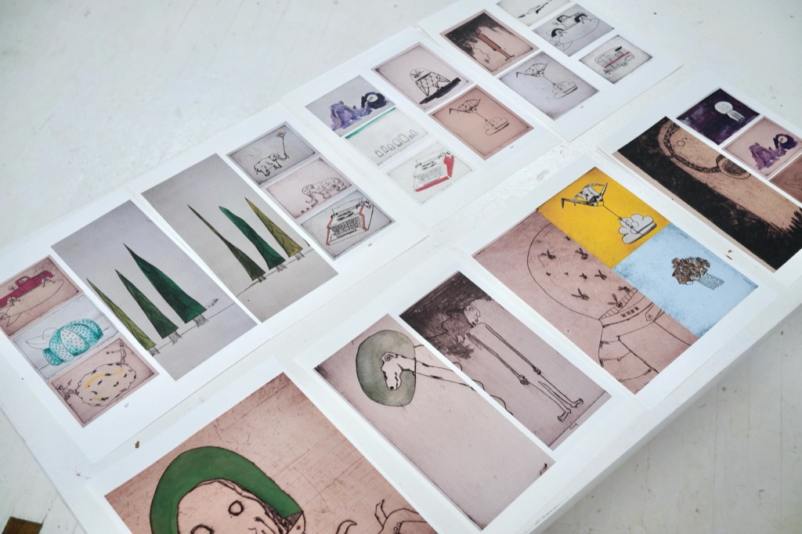
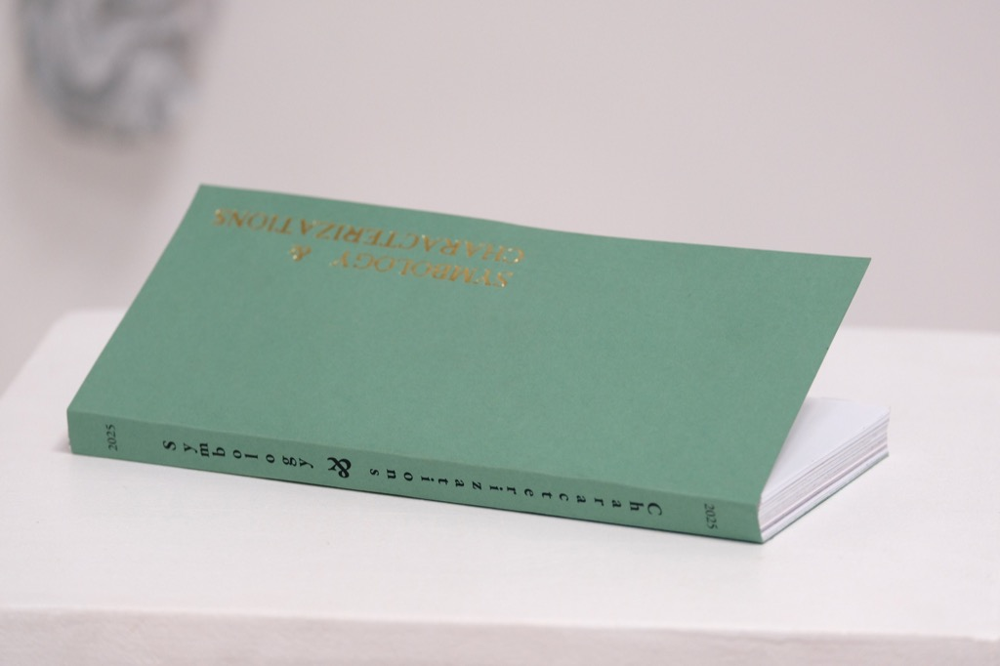
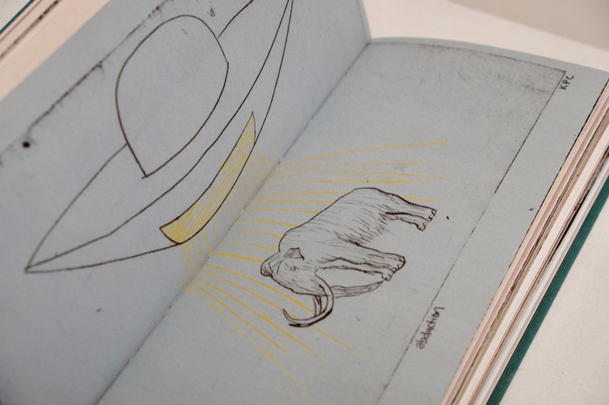

+++
+++

## A.M.P #8 | symbology & characterization

by: Kyle Parker Cunningham 
176 pages, 4 x 9 inches  
Edition of 100. 
ISBN: 978-1-969143-02-1

We are all telling stories to our own minds which enable us to continue the life long story we are individually curating into the collective cacophony. Symbology, repeated, iterated, drifting in time and space, eventually reinterpreted. Characterizations, a short hand to professed understanding, revised realities, recommended availability, role playing and misunderstandings, innovations. In here we find assembly theory; building a life out of the blocks we are able to get our hands upon. 

This is the most experimental of our books to date. Book form is explored enticing an interactive viewing of the content - it is to be hand held and felt through the fingertips to the soul of understanding you too were once and elephant wearing an elephant mask.

Permutations of the printed form, reduced and reused plates each one unique and yet floating through the world with siblings. You find solace in the quantity and variation of reality. Where will this take us? Where will we end up? 

The imagery floats from a world adjacent to our reality and our minds reality. A third space intertwinted with spirits and future fallibility. We are alive because we are alive. 

softcover
4 x 9 inches.  
176 pages.

  
## Press Kit

### Images

- [Symbology & Characterizations Cover](s-and-c-cover.jpeg)
- [Symbology & Characterizations Title Page](s-and-c-title-page.jpeg)
- [Symbology & Characterizations Image 1](s-and-c-1.jpeg)

