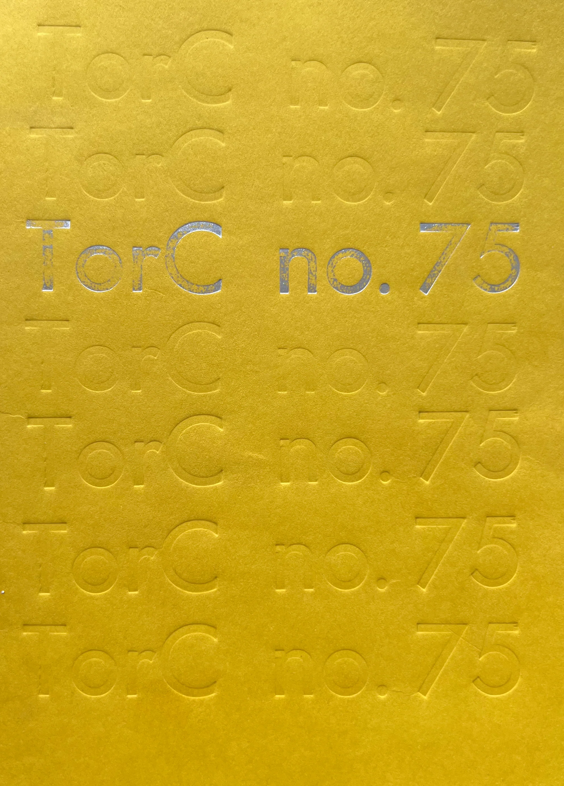
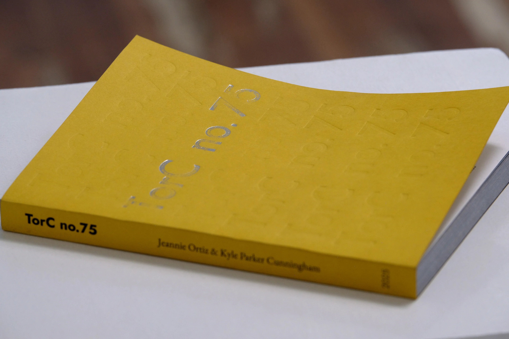

+++
+++

# A.M.P. #2:  TorC no.75 

by: Jeannie Ortiz & Kyle Parker Cunningham  
196 pages, 6 x 8 inches 
ISBN: 978-1-969143-04-5 
Edition of 200 

>From dawn to the center of night.

>75 years renamed.

>A book requiring no other explanation just like this desert oasis town which defies all expectations.

The persona of our town changed 75 years ago this year when Hot Springs, New Mexico became Truth or Consequences, New Mexico. We took a long look at our time in this oasis village quilted a day together our of 15 years of days lived with camera in hand. TorC NM is quit and empty and full of power lines.

The emotional understanding of a place in the universe.

There is an oasis on the banks of the Rio Grande apart certainly from the whole of the world but a couple of decades. Sleeping super volcanos fuel scalding waters cooled by rocks long ago heated by magma. Minerals disolved heavily before reaching the surface healing bones in weary souls. 

The geology of this place enforces a timeless. There is a deep history hear - ancient corals, neolithic pit houses, 100 year old arrow heads, 50 year old rust. No one moves here unless they want an expansive experience of time - a horizon stretching out as far as a life allows one to explore the finges of society while expanding their creativity. 

We don't look towards the clock often here because the continuim stretchs for a 1/4 of earths history. You escape to this place to be a time traveler in a socity robotically obsessed with the deadline. 

TorC no.75 is a snapshot of a collective experience as this strange place celbrates a 75 year milestone of name changing for publicicity - quite some years before the advent of the social media influencer. We had a fast start but still havn't made it out of the radio era.   

We are multidimensionally insatiable and this publication doesn't deviate from that axiom. We look at this moment, remembering the past, while imagining our future. There is no continuiting of time to be had, just as if you were living in Truth or Consequences, New Mexico. 

This publication itself exists annually - this innagural issue number 75 on occasion of this diamond jubilee of our namesakes genesis We look at this moment, remembering the past, while imagining our future. There is no continuiting of time to be had, just as if you were living in Truth or Consequences, New Mexico. 

This publication itself exists annually - this innagural issue number 75 on occasion of this diamond jubilee of our lastest name. Each year we will share different vignettes of a shared history, current, lived or imagined. 

## Press Kit

### Releases

### Images

[TorC no.75 Cover](torc75-cover.webp)
