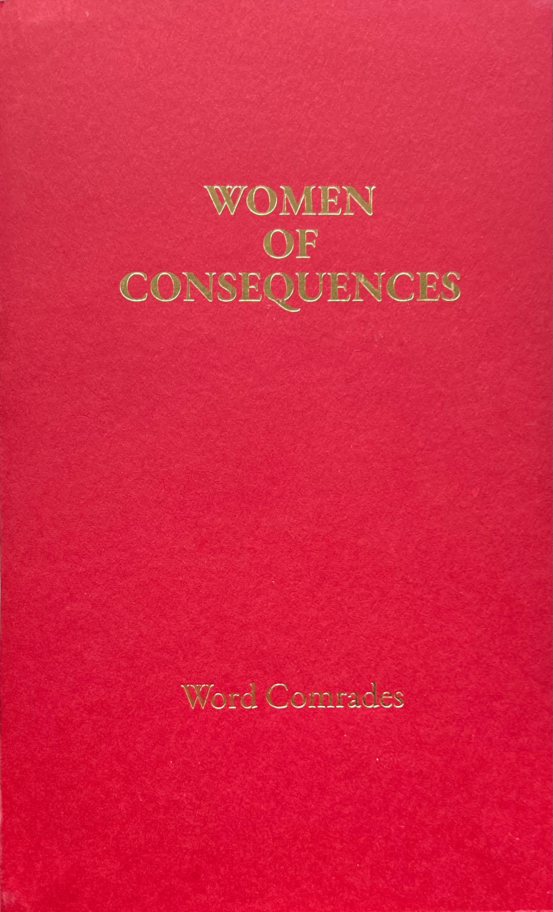
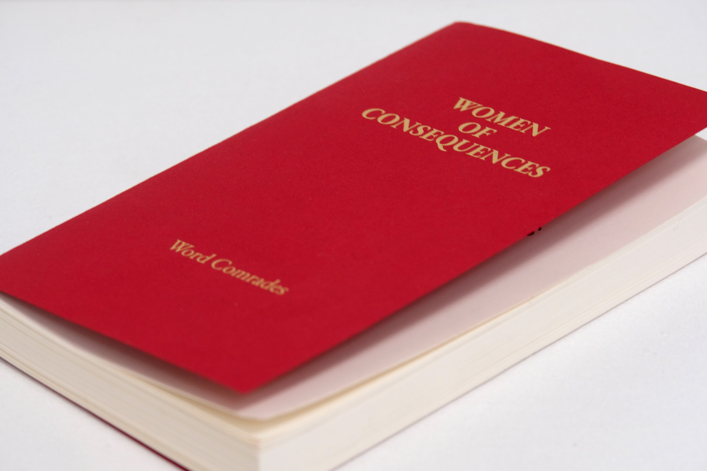
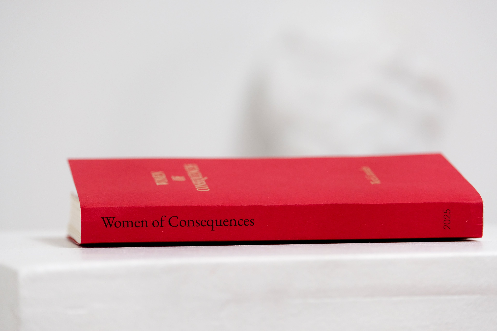
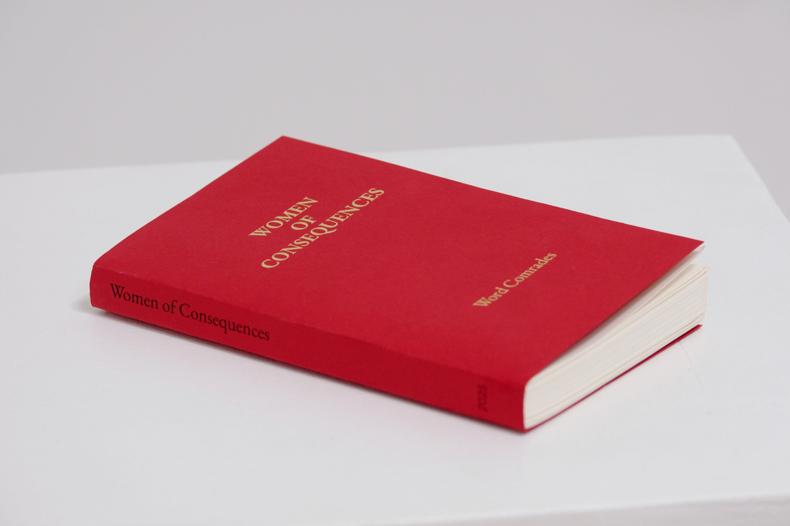
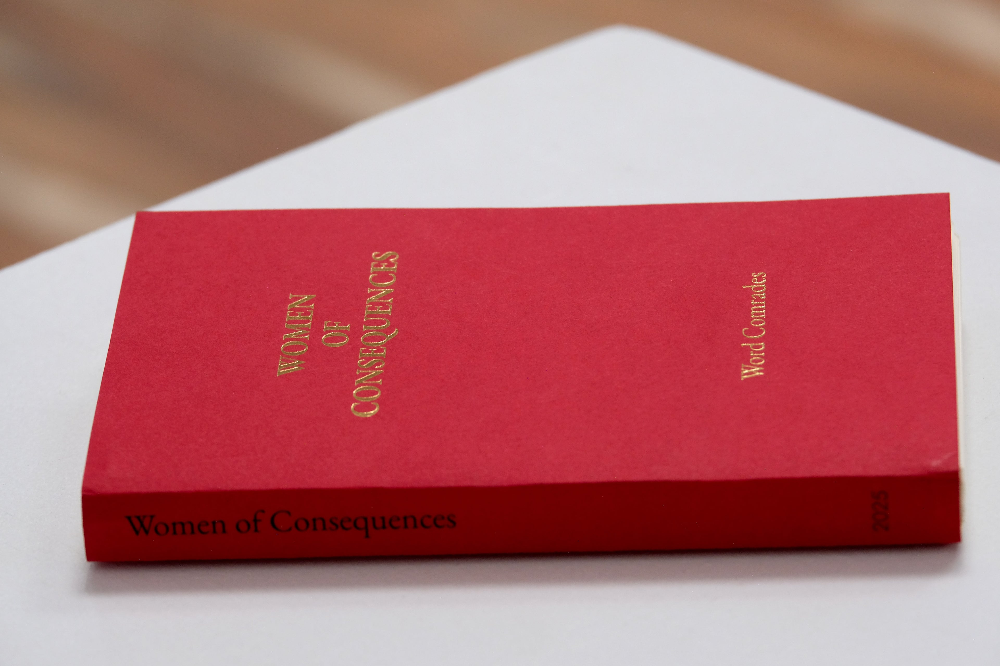
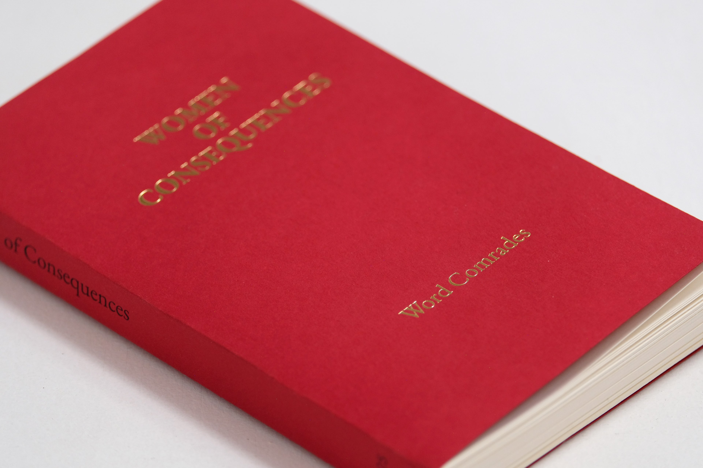

+++
+++

# A.M.P #4:    Women of Consequences:   Word Comrades

A collection of works from 19 women writers in Truth or Consequences, New Mexico who have been meeting weekly for years. 

214 pages, 4.375 x 7.125 inches  
ISBN: 978-1-969143-00-7 
Edition of 300 

[Purchase Women of Consequences](https://shop.torc.art/agile-meteor-press)

>“The women in the group write fiction, memoir, travelogue, reflection, poem, prayer, rant, manifesto, explanation, jewel-like description and word collage. We write what we please. I could write nonsense and it would be well received. We can do anything in the protected space of our mutual creation.


>This collection -- inspired and curated by Jessica Logreira -- is a taste of our work. It is the result of a beautiful Truth or Consequences community, one of many that this special place and these special women spawn.”

A perfect description written by Victoria Boynton in the preface to the book.  

## Word Comrades

- Stephanie Townsend Allala
- RJ Blanch Almquist
- Zephyr Rose Anders
- Baby D
- Victoria Boynton
- Rhonda Brittan
- Connie Brown
- Kari Conley
- Yadi Flannery
- Kathleen Kemsley
- Jessica Logreira
- Misha Martin
- Bonita Nielsen
- Colleen Palmer
- Cheryl Ray
- Bear Sahlfeld
- Roxanne VanWormer
- Feral Willcox
- Alice Wyatt

>"There are unintended consequences - is there an unintended consequence? Can I accidentally become important? I can’t see why I couldn’t experience the consequences of my own consequence. 

>Unintended truth - now that I can imagine. Jotting down a grocery list that, through some mischievous alchemy, becomes a short story about how I hate my mother. “Hate” is such a strong word, but so is “artichoke.” Like, “I could have artichoked her when she said that to my boyfriend.” Is there a counterpart to truth? One truth stands alone, conspicuous. Truths are held to be self-evident, as in all vegetables are created equal. Self-evident means obvious, like “it’s obvious I’m fucked up,” only I’m not. I am art, not choked. I am surrendering to the consequences of truth, accepting my own consequence. What if I am not waiting for wisdom, but Wisdom is waiting for me? What if I am not the receiver of light, but the source? 

>What if I must face the consequences of my own consequence?"

## Opening Party

Join us to celebrate the release of this book on November 7th at Truth or Consequences Contemporary - 312 Main Ave, TorC NM. 

[Purchase Women of Consequences](https://shop.torc.art/agile-meteor-press)

## Press Kit

### Documents and Announcements

- [Press Release](woc-press-release.pdf)

<!-- 
- [Open Party Invitaiton (November 7th, 2025)](opening-party.pdf)
-->

### Images

We provide these full size images ready to use for promotional and editorial purposes for this book. 

- [Women of Consequences Cover](woc-front-cover.jpeg)
- [Women of Consequences Image no. 1](woc-1.jpg)

